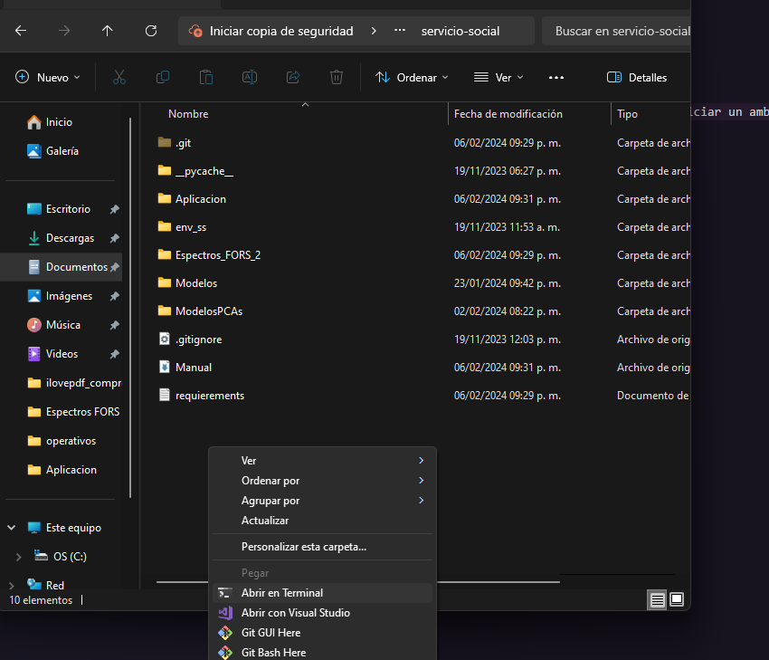
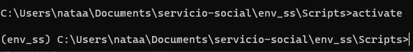
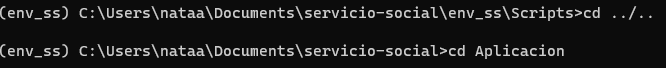
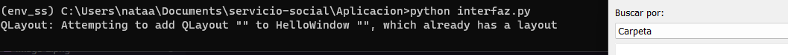
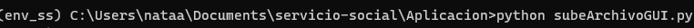

# Programa para Servicio social
## Requerimientos

Instalación de python 3.11.4
Se puede descargar el instalador en https://www.python.org/downloads/release/python-3117/

[alt text](image/install_python.png)

Elegir  el recomendado: Windows installer (64-bit)

### Ejecutar ambiente
Para ejecutar cualquiera de los programas es necesario iniciar un ambiente virtual de python:
#### En Windows

Desde el navegador de documentos de la carpeta 'servicio-social' dar click derecho como en la imagen y seleccionar 'Abrir en Terminal'

Ejecutar lo siguiente:
1. cd env_ss
2. cd Scripts
3. activate
4. 

Si fue activado exitosamente vera algo similar

Una vez activo proceder

### Ejecutar buscador
Ejecutar 
1. cd ../..
2. cd Aplicacion

3. python organizador.py

### Ejecutar Aproximador
Ejecutar: python clasificador.py

## PROGRAMA:ORGANIZADOR

El objetivo de este programa es proveer con una interfaz para mantener organizadas mediciones de espectros FORS proporcionando filtros y la posibilidad de gráficar y combinar gráficas. Notemos un ejemplo para utilizar los filtros:

|*

