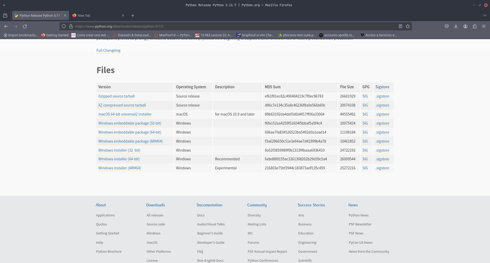
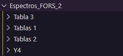
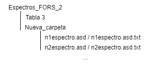
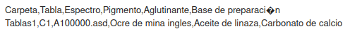
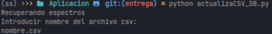
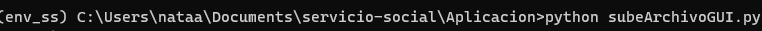
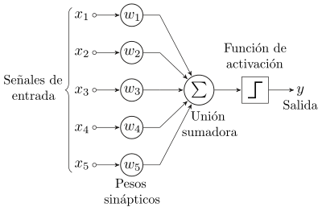

# Programa para Servicio social
## Requerimientos

Instalación de python 3.11.4
Se puede descargar el instalador en https://www.python.org/downloads/release/python-3117/



Elegir  el recomendado: Windows installer (64-bit)

### Ejecutar ambiente
Para ejecutar cualquiera de los programas es necesario iniciar un ambiente virtual de python

Crear entorno virtual:

```sh
python -m venv tutorial-env
```
Una vez creado el entorno virtual, podrás activarlo.

En Windows, ejecuta:

```sh
tutorial-env/Scripts/activate
```

En Unix o MacOS, ejecuta:

```sh
source tutorial-env/bin/activate
```
Para más detalles consultar en https://docs.python.org/es/3/tutorial/venv.html

Luego instalar requerimientos en Aplicacion\requi.txt

Una vez activo el ambiente, instalar requerimientos:
```sh
pip install -r Aplicacion/requi.txt
```

### Utilizando script de python
Ejecutar desde la carpeta del proyecto:
```sh
python Aplicacion/setup.py
```

## Actualizar Base de Datos para el programa

Para ingresar una nueva tabla de mediciones es necesario incluir la nueva carpeta dentro de Espectros_FORS_2. En la misma altura que Tabla 3, Tablas 1, etc.



De forma que la estructura es la siguiente



Y la ruta a un espectro será: Espectros_FORS_2/Nueva_carpeta/n1espectro.asd.txt

Crear un archivo csv con la siguiente estructura:

|


Ejecutar el archivo actualizaCSV_DB.py, e introducir el nombre del archivo csv que debe estar en la misma carpeta que actualizaCSV_DB.py



## PROGRAMA:ORGANIZADOR

El objetivo de este programa es proveer con una interfaz para mantener organizadas mediciones de espectros FORS proporcionando filtros y la posibilidad de gráficar y combinar gráficas. Notemos un ejemplo para utilizar los filtros:

| Filtro  | Descripción | Ejemplo |
|:------------- |:---------------:| -------------:|
| Carpeta       | El nombre de la carpeta donde se encuentran las tablas  | Tabla 3     |
| Tabla    | El nombre, o etiqueta, de la tabla        | C1       |
| Espectro         | Nombre del archivo     | A100000.asd |
| Pigmento         | Pigmento del espectro     | Ocre de mina ingles      |
| Aglutinante         | Aglutinante del espectro    | Aceite de linaza     |
| Base_de_preparacion         | Base de preparación del espectro     | Carbonato de calcio      |


## PROGRAMA:CLASIFICADOR

El objetivo de este programa es proveer con una interfaz que permita subir un archivo de una medición FORS en formato asd o txt y realizar una clasificación a partir del entranamiento realizado sobre la base de datos del organizador.
El programa provee de 6 algoritmos de clasificación:

### Regresion logistica

En estadística, el modelo logístico (o modelo logit) se utiliza para modelar la probabilidad de que exista una determinada clase o evento como pasa / no pasa, gana / pierde, vivo / muerto o sano / enfermo. (Tiene dado pigmento, dado aglutinante)

La regresión logística analiza datos distribuidos binomialmente de la forma

donde los números de ensayos Bernoulli ${\displaystyle n_{i}}$ son conocidos y las probabilidades de éxito ${\displaystyle p_{i}}$ son desconocidas. 

El modelo es entonces obtenido a base de lo que cada ensayo (valor de ${\displaystyle i}$) y el conjunto de variables explicativas/independientes puedan informar acerca de la probabilidad final. Estas variables explicativas pueden pensarse como un vector 
${\displaystyle X_{i}}$ ${\displaystyle k}$-dimensional y el modelo toma entonces la forma:



Los logits de las probabilidades binomiales desconocidas (i.e., los logaritmos de la razón de momios) son modeladas como una función lineal de los ${\displaystyle X_{i}}$.


Note que un elemento particular de ${\displaystyle X_{i}}$ puede ser ajustado a 1 para todo ${\displaystyle i}$ obteniéndose una constante independiente en el modelo. Los parámetros desconocidos ${\displaystyle \beta _{j}}$ son usualmente estimados a través del método de máxima verosimilitud.


### Perceptron
En el campo de las Redes Neuronales, el perceptrón, creado por Frank Rosenblatt, se refiere a: la neurona artificial o unidad básica de inferencia en forma de discriminador lineal, a partir de lo cual se desarrolla un algoritmo capaz de generar un criterio para seleccionar un subgrupo a partir de un grupo de componentes más grande.



### Regresion lineal

En estadística, la regresión lineal o ajuste lineal es un modelo matemático usado para aproximar la relación de dependencia entre una variable dependiente ${\displaystyle Y}$, 
${\displaystyle m}$ variables independientes 
${\displaystyle X_{i}}$ con 
${\displaystyle m\in \mathbb {Z} ^{+}}$ y un término aleatorio ${\displaystyle \varepsilon}$. 

Este modelo puede ser expresado como:

${\displaystyle Y=\beta _{0}+\beta _{1}X_{1}+\cdots +\beta _{m}X_{m}+\varepsilon }$
donde:

${\displaystyle Y}$ es la variable dependiente o variable de respuesta.

${\displaystyle X_{1},X_{2},\dots ,X_{m}}$ son las variables explicativas, independientes o regresoras.

${\displaystyle \beta _{0},\beta _{1},\beta _{2},\dots ,\beta _{m}}$ son los parámetros del modelo, miden la influencia que las variables explicativas tienen sobre el regrediendo.
el término  ${\displaystyle \beta _{0}}$ es la intersección o término "constante", las ${\displaystyle \beta _{i}\ (i\geq 1)}$ son los parámetros respectivos a cada variable independiente, y ${\displaystyle m}$ es el número de parámetros independientes a tener en cuenta en la regresión.

### Naive Bayes classifier

Un clasificador de Naive Bayes asume que la presencia o ausencia de una característica particular no está relacionada con la presencia o ausencia de cualquier otra característica, dada la clase variable. Por ejemplo, una fruta puede ser considerada como una manzana si es roja, redonda y de alrededor de 7 cm de diámetro. Un clasificador de Naive Bayes considera que cada una de estas características contribuye de manera independiente a la probabilidad de que esta fruta sea una manzana, independientemente de la presencia o ausencia de las otras características.
El clasificador Bayer (la función ${\displaystyle \mathrm {classify} })$ se define como:


### C-Support Vector Classification.
Una SVM es un modelo que representa a los puntos de muestra en el espacio, separando las clases a 2 espacios lo más amplios posibles mediante un hiperplano de separación definido como el vector entre los 2 puntos, de las 2 clases, más cercanos al que se llama vector soporte. Cuando las nuevas muestras se ponen en correspondencia con dicho modelo, en función de los espacios a los que pertenezcan, pueden ser clasificadas a una o la otra clase.

Más formalmente, una SVM construye un hiperplano o conjunto de hiperplanos en un espacio de dimensionalidad muy alta (o incluso infinita) que puede ser utilizado en problemas de clasificación o regresión. Una buena separación entre las clases permitirá una clasificación correcta.

### Random Forest
Random forest (o random forests) también conocidos en castellano como Bosques aleatorios es una combinación de árboles predictores tal que cada árbol depende de los valores de un vector aleatorio probado independientemente y con la misma distribución para cada uno de estos. Es una modificación sustancial de bagging que construye una larga colección de árboles no correlacionados y luego los promedia.

Cada árbol es construido usando el siguiente algoritmo:

1. Sea N el número de casos de prueba, M es el número de variables en el clasificador.

2. Sea m el número de variables de entrada a ser usado para determinar la decisión en un nodo dado; m debe ser mucho menor que M

3. Elegir un conjunto de entrenamiento para este árbol y usar el resto de los casos de prueba para estimar el error.

4. Para cada nodo del árbol, elegir aleatoriamente m variables en las cuales basar la decisión. Calcular la mejor partición del conjunto de entrenamiento a partir de las m variables.

Para la predicción un nuevo caso es empujado hacia abajo por el árbol. Luego se le asigna la etiqueta del nodo terminal donde termina. Este proceso es iterado por todos los árboles en el ensamblado, y la etiqueta que obtenga la mayor cantidad de incidencias es reportada como la predicción.